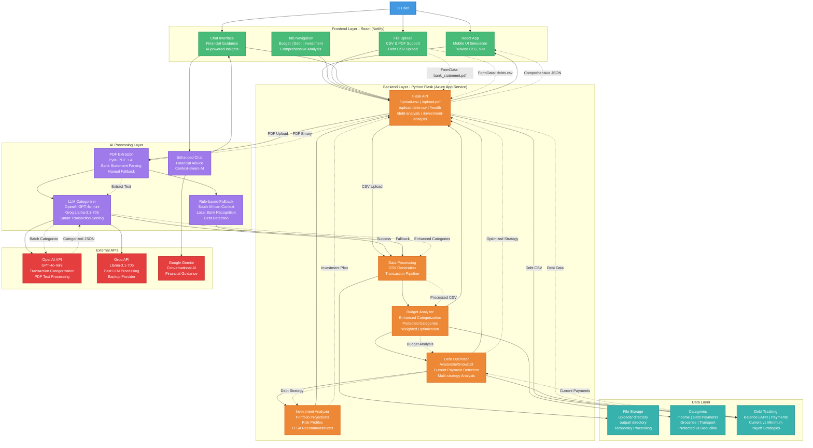

To view the prototype in action - click on the URL

#  Enhanced Financial Analyzer

A comprehensive financial analysis system that transforms bank statements into actionable insights using AI-powered categorization, debt optimization strategies, and investment projections tailored for South African financial markets.

##  Features

###  **Smart Transaction Categorization**
- **AI-Powered Classification**: Uses OpenAI GPT-4o-mini and Groq Llama-3.1-70b for intelligent transaction categorization
- **South African Context**: Recognizes local banks, merchants, and payment patterns (Shoprite, Pick n Pay, SASSA, etc.)
- **Rule-Based Fallback**: Robust backup system for when AI services are unavailable
- **PDF & CSV Support**: Automatically extracts data from bank statement PDFs or processes CSV files

###  **Enhanced Budget Analysis**
- **Protected Categories System**: Automatically identifies and protects fixed obligations (debt payments, rent) from optimization
- **Weighted Optimization**: Income bracket-aware suggestions based on South African household spending patterns
- **Realistic Constraints**: Location-specific expense ratios and culturally relevant reduction strategies
- **Action Plans**: Prioritized immediate, short-term, and long-term financial improvement steps

###  **Advanced Debt Optimization**
- **Current Payment Detection**: Automatically finds existing debt payments in your bank statements
- **Multi-Strategy Analysis**: 
  - **Avalanche Method**: Pay high-interest debts first (saves most money)
  - **Snowball Method**: Pay smallest balances first (psychological wins)
- **Interest Savings Calculator**: Shows potential savings vs minimum payments only
- **Comprehensive Debt Tracking**: Balance, APR, current vs minimum payments

###  **Investment Projections**
- **Risk-Adjusted Returns**: Conservative, moderate, and aggressive portfolio projections
- **TFSA Integration**: Tax-Free Savings Account recommendations (R35,000 annual limit)
- **Compound Growth Modeling**: Future value calculations with volatility adjustments
- **South African Context**: Local investment considerations and tax implications

## 🏗 Architecture



## 🛠 Tech Stack

### Backend (Python Flask)
- **Framework**: Flask 2.3.3 with CORS support
- **Data Processing**: Pandas 2.1.1 for financial calculations
- **AI Integration**: OpenAI 1.3.7, Groq 0.4.1 for LLM services
- **PDF Processing**: PyMuPDF 1.23.8 for bank statement extraction
- **Deployment**: Azure App Service (Free tier compatible)

### Frontend (React)
- **Framework**: React with Vite for fast development
- **Styling**: Tailwind CSS for responsive mobile-first design
- **UI Components**: Mobile-optimized financial dashboard
- **Deployment**: Netlify static hosting

### AI Services
- **Primary LLM**: OpenAI GPT-4o-mini for transaction categorization
- **Backup LLM**: Groq Llama-3.1-70b for redundancy and cost optimization
- **Chat Interface**: Google Gemini for conversational financial guidance

## 🚀 Quick Start

### Prerequisites
- Python 3.8+
- Node.js 16+ (for frontend)
- OpenAI API key (optional but recommended)
- Groq API key (optional backup)

### Backend Setup

1. **Clone the repository**
```bash
git clone <repository-url>
cd financial-analyzer
```

2. **Create virtual environment**
```bash
python -m venv venv
source venv/bin/activate  # On Windows: venv\Scripts\activate
```

3. **Install dependencies**
```bash
pip install -r requirements.txt
```

4. **Create configuration files**

Create `config.py`:
```python
import os
from dotenv import load_dotenv

load_dotenv()

# API Keys
OPENAI_API_KEY = os.getenv("OPENAI_API_KEY")
GROQ_API_KEY = os.getenv("GROQ_API_KEY")

# Directories
DATA_DIRECTORY = os.path.join(os.path.dirname(__file__), "data")
OUTPUT_DIRECTORY = os.path.join(os.path.dirname(__file__), "output")

# Ensure directories exist
os.makedirs(DATA_DIRECTORY, exist_ok=True)
os.makedirs(OUTPUT_DIRECTORY, exist_ok=True)
```

Create `.env`:
```env
OPENAI_API_KEY=your_openai_key_here
GROQ_API_KEY=your_groq_key_here
```

5. **Run the application**
```bash
python app.py
```

The API will be available at `http://localhost:5000`

### Frontend Setup

```bash
cd frontend
npm install
npm run dev
```

The React app will be available at `http://localhost:5173`

## 📋 API Endpoints

### Core Endpoints

| Endpoint | Method | Description |
|----------|--------|-------------|
| `/health` | GET | System health check and feature status |
| `/upload-csv` | POST | Upload bank statement CSV for analysis |
| `/upload-pdf` | POST | Upload bank statement PDF for extraction and analysis |
| `/upload-debt-csv` | POST | Upload debt information for optimization |
| `/debt-analysis` | POST | Analyze debt payoff strategies |
| `/investment-analysis` | POST | Calculate investment projections |
| `/comprehensive-analysis` | POST | Get complete financial analysis |

### Example Usage

**Upload Bank Statement:**
```bash
curl -X POST \
  -F "file=@bank_statement.pdf" \
  http://localhost:5000/upload-pdf
```

**Debt Analysis:**
```bash
curl -X POST \
  -H "Content-Type: application/json" \
  -d '{"available_monthly": 1500}' \
  http://localhost:5000/debt-analysis
```

## Data Formats

### Bank Statement CSV Format
```csv
Date,Description,Amount (ZAR),Balance (ZAR)
2025-07-01,Opening Balance,,150.0
2025-07-01,Account Maintenance Fee,-5.0,145.0
2025-07-01,Salary – Acme Co,5600.0,5745.0
2025-07-02,Rent – Room Share,-1500.0,4245.0
2025-07-03,Shoprite Groceries,-950.0,3295.0
```

### Debt Information CSV Format
```csv
name,balance,apr,min_payment,kind
Credit Card,8500.00,0.22,200.00,credit_card
Car Loan,45000.00,0.12,800.00,auto_loan
Personal Loan,12000.00,0.18,350.00,personal_loan
```

## 🔧 Configuration

### Environment Variables

- `OPENAI_API_KEY`: OpenAI API key for GPT-4o-mini access
- `GROQ_API_KEY`: Groq API key for Llama-3.1-70b backup
- `FLASK_ENV`: Set to `development` for debug mode

### Feature Toggles

The system automatically detects available features:
- AI categorization (requires API keys)
- Enhanced debt optimization
- Investment analysis
- Protected categories system

## 🚀 Deployment

### Azure App Service (Backend)

1. **Create App Service**
```bash
az webapp create \
  --resource-group myResourceGroup \
  --plan myAppServicePlan \
  --name my-financial-analyzer \
  --runtime "PYTHON|3.11"
```

2. **Configure App Settings**
```bash
az webapp config appsettings set \
  --name my-financial-analyzer \
  --resource-group myResourceGroup \
  --settings OPENAI_API_KEY="your-key" GROQ_API_KEY="your-key"
```

3. **Deploy Code**
```bash
az webapp deployment source config \
  --name my-financial-analyzer \
  --resource-group myResourceGroup \
  --repo-url https://github.com/your-repo \
  --branch main
```

### Netlify (Frontend)

1. Connect your repository to Netlify
2. Set build command: `npm run build`
3. Set publish directory: `dist`
4. Add environment variable: `VITE_API_URL=https://your-backend.azurewebsites.net`

##  Testing

### Run Backend Tests
```bash
# Test API endpoints
curl http://localhost:5000/health

# Test file upload
curl -X POST -F "file=@sample_statement.csv" http://localhost:5000/upload-csv
```

### Sample Data

The repository includes sample files:
- `sample_bank_statement.csv`: Example transaction data
- `sample_debts.csv`: Example debt information
- `sample_bank_statement.pdf`: Example PDF statement

##  Security & Privacy

- **Data Processing**: All financial data is processed locally and temporarily
- **File Cleanup**: Uploaded files are automatically deleted after processing
- **API Security**: CORS configured for frontend-backend communication
- **No Data Storage**: No persistent storage of personal financial information

##  South African Financial Context

### Supported Features
- **Currency**: South African Rand (ZAR)
- **Banks**: Recognition of major SA banks (FNB, Standard Bank, ABSA, Nedbank)
- **Merchants**: Local retailers (Shoprite, Pick n Pay, Checkers, Spar, Woolworths)
- **Payments**: SASSA grants, EFT payments, debit orders
- **Investments**: TFSA recommendations and local investment context

### Income Brackets
- Very Low: R0 - R3,500/month
- Low: R3,500 - R8,000/month
- Low-Middle: R8,000 - R15,000/month
- Middle: R15,000 - R25,000/month
- Upper-Middle: R25,000+/month

##  Contributing

1. Fork the repository
2. Create a feature branch (`git checkout -b feature/amazing-feature`)
3. Commit your changes (`git commit -m 'Add amazing feature'`)
4. Push to the branch (`git push origin feature/amazing-feature`)
5. Open a Pull Request

##  License

This project is licensed under the MIT License - see the [LICENSE](LICENSE) file for details.

##  Support

- **Documentation**: Check the `/docs` folder for detailed guides
- **Issues**: Report bugs via GitHub Issues
- **API Status**: Check `/health` endpoint for system status

##  Roadmap

- [ ] Mobile app (React Native)
- [ ] Advanced investment recommendations
- [ ] Integration with local banks' APIs
- [ ] Multi-language support (Afrikaans, Zulu, Xhosa)
- [ ] Automated monthly reports
- [ ] Goal tracking and progress monitoring

---
